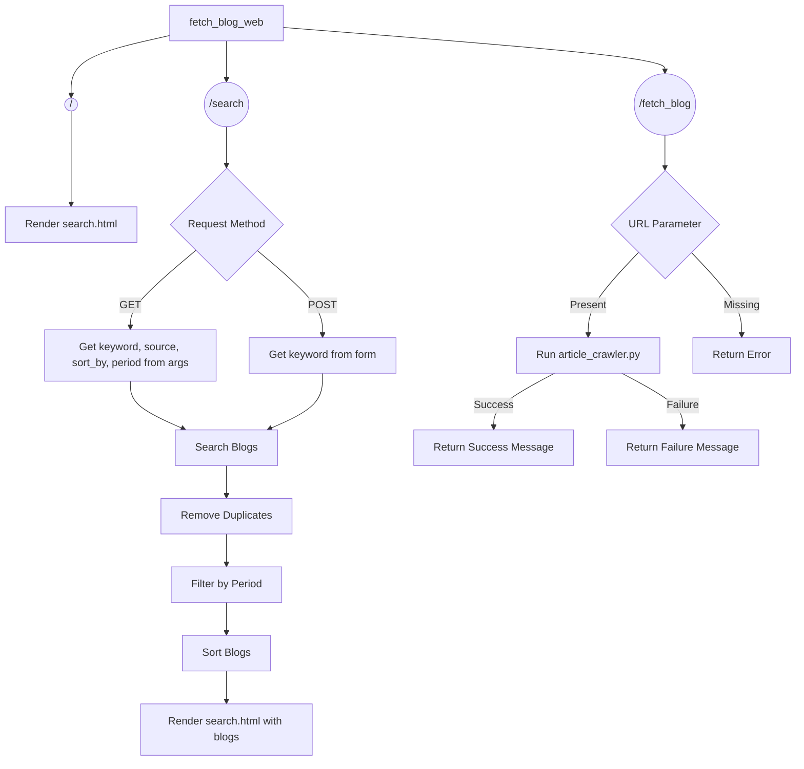
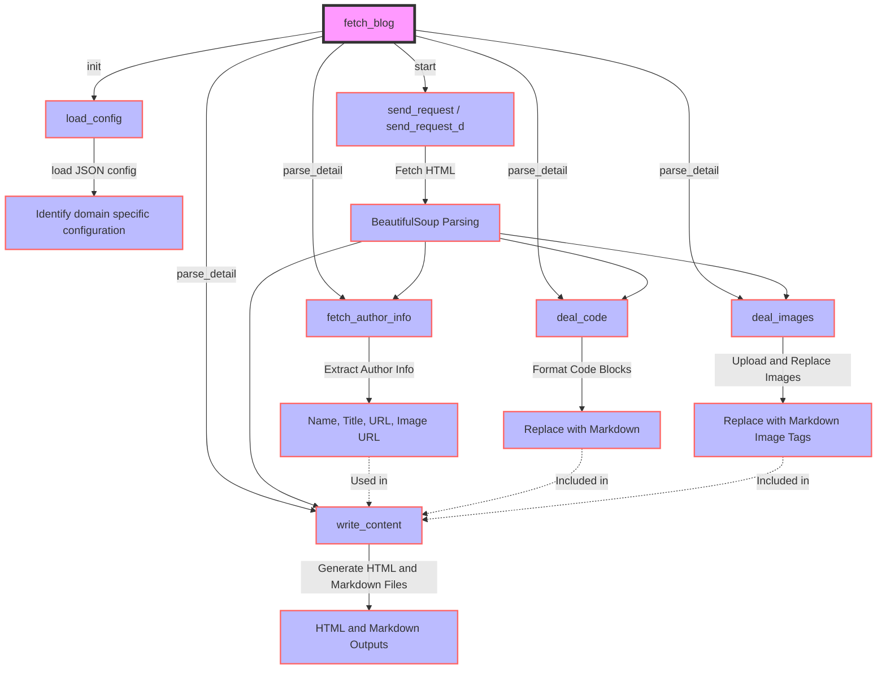

# fetch blog

## 项目简介

`fetch blog`是一个用于爬取并保存文章内容的Python脚本。它支持从掘金(juejin)和知乎(zhihu)等平台上爬取文章。

## 安装指南

本项目使用Python编写，要运行此脚本，您需要先确保已安装Python环境。

1. 克隆仓库到本地：

   ```
   git clone https://github.com/BrunoGao/fetch_blog.git
   ```

2. 安装依赖：

   ```
   pip install -r requirements.txt
   ```

## 使用方法
### web 界面模式， 支持 juejin 和 csdn。

1. 启动 web server

   ```
   python3 fetch_blog_web.py
   ```

2. 访问 web server

   ```
   http://localhost:5001/search
   ```

3. 输入标题进行搜索, 点击 "Search" 
   

4. 在下面的博客列表中, 选择要爬取的博客

5. 点击 "一键复制" 

6. 复制后的博客如下图:
   

### 命令行模式
   也可以直接在命令行中运行 `fetch_blog.py` ，命令行模式支持 juejin、csdn、简书和知乎。
   ```
   python3 fetch_blog.py -u https://www.jianshu.com/p/609878670 -o ./data
   ```

## 主要流程




## 功能特性

- 支持从掘金,知乎,csdn和简书平台爬取文章。
- web 界面搜索, 掘金风格
- 代码自动识别并高亮
- 图片自动转存到自己的图床
